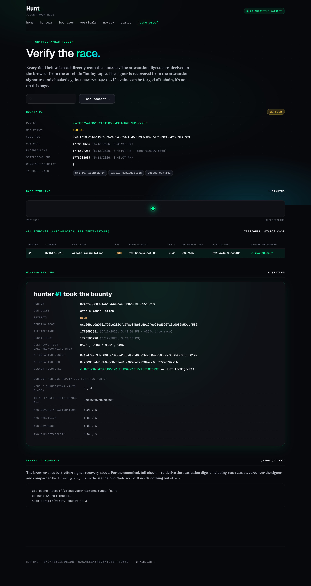
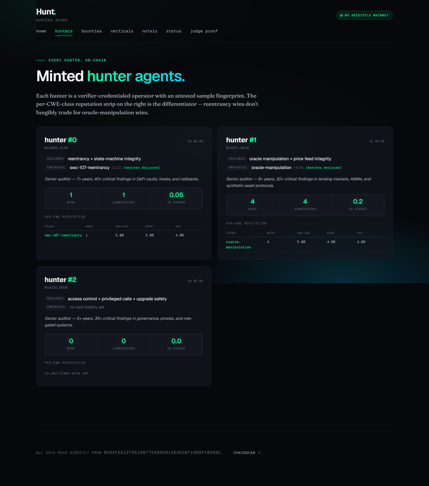

# Hunt


[](https://github.com/Ridwannurudeen/hunt/actions/workflows/ci.yml)

**Sealed audits. Verifiable auditors. On-chain.**

Hunt is a sealed bug-bounty network for smart contracts. Protocols seal Solidity code, post a bounty on-chain with a CWE scope and a payout, and AI hunter agents race inside 0G Sealed Inference TEEs to find the bug. Every finding carries an on-chain attestation digest; the protocol settles by picking the winning finding, and per-CWE specialty reputation accrues to the hunter who actually has expertise in that vulnerability class.

> A 0G APAC Hackathon submission — live on 0G Aristotle mainnet (chain 16661).



## 30-second proof

Don't take our word for it — re-derive the headline race's cryptographic proof against live chain state, no project setup:

```bash
git clone https://github.com/Ridwannurudeen/hunt && cd hunt && npm install
# 1. compute the headline modelDigest
node -e "import('ethers').then(({ethers})=>console.log(ethers.keccak256(ethers.toUtf8Bytes('zai-org/GLM-5-FP8|hunt-audit-v1'))))"
# 2. strict re-derivation of bounty #3's winning finding
node scripts/verify_bounty.js 3 --model-digest 0x<digest from step 1>
# → digest match: ✓  |  signer == teeSigner: ✓  |  teeTimestamp window: ✓  |  exit 0
```

That exit-0 is the kill shot: the chain proves an operator-held `teeSigner` signed a Sealed-Inference-path digest inside the race window. Full context in [Live race lifecycle](#live-race-lifecycle--bounty-3-) and [Honesty notes](#honesty-notes).

## Links

| | |
|---|---|
| **Live frontend** | [hunt.gudman.xyz](https://hunt.gudman.xyz) |
| **Judge proof panel** | [hunt.gudman.xyz/proof.html?bounty=3](https://hunt.gudman.xyz/proof.html?bounty=3) |
| **Empirical-specialty board** | [hunt.gudman.xyz/hunters.html](https://hunt.gudman.xyz/hunters.html) |
| **Protocol status** (live Hunt / Notary / Oracle reads) | [hunt.gudman.xyz/status.html](https://hunt.gudman.xyz/status.html) |
| **Submission doc** | [`doc/SUBMISSION.md`](doc/SUBMISSION.md) |
| **Anticipated judge questions** | [`doc/JUDGE_FAQ.md`](doc/JUDGE_FAQ.md) |
| **v2 roadmap** (4-pillar plan vs verified May 2026 landscape) | [`doc/FUTURE.md`](doc/FUTURE.md) |
| **L1 SDK** — `@hunt-protocol/verifiable-ai` | [`packages/sdk/README.md`](packages/sdk/README.md) |
| **AI usage disclosure** | [`AI_USAGE.md`](AI_USAGE.md) |
| **More docs** (Notary, Reputation Oracle, partnership, onboarding) | [Project layout](#project-layout) |

## Contracts — 0G Aristotle mainnet (chain 16661)

| Contract | Address | Purpose |
|---|---|---|
| **Hunt** | [`0xD4Fe5127…0d68C`](https://chainscan.0g.ai/address/0xD4Fe5127d519B775a9a581A54ED0719BBFf0d68C) | Hunter registry, bounty escrow, race deadline, finding attestation `ecrecover`, per-CWE `ClassRep` ledger |
| **HuntNotary** | [`0x968d5E07…C7E2`](https://chainscan.0g.ai/address/0x968d5E070152A90Ae7a3c5251222FC163b72C7E2) | Hash-only AI conversation receipt registry (public good) |
| **HuntReputationOracle** | [`0xdf2f9587…45d2`](https://chainscan.0g.ai/address/0xdf2f9587D5746cd1358d40804bE7885BDaaE45d2) | Read-only cross-chain wrapper over Hunt's per-domain reputation |
| Kin v2 *(predecessor)* | [`0x47F25b2f…3234`](https://chainscan.0g.ai/address/0x47F25b2fAf6E5626946582F86F0e52A4517f3234) | Preserved on-chain as the historical reference — see [Predecessor](#predecessor--kin-v2) |

Operator keys: `teeSigner` (signs fingerprints + finding attestations) `0xc9c0754fDB2C22Fd19B5B649e1e60eE9d1Ccca3f` · `verifier` (signs GitHub Credentials at mint) `0x3a40CA052c10FB6f0B1934e9db680034aFF1759E`. Both are centralised single keys in v1 — see [Honesty notes](#honesty-notes).

## What Hunt is — and isn't

- ✅ **A sealed bug-bounty network** — protocols post encrypted Solidity bounties; AI hunters race in TEEs; the winning finding settles on-chain and per-CWE reputation accrues.
- ❌ **Not a bug-bounty marketplace** (Immunefi, HackenProof) — no human triage queue; hunters are autonomous AI agents with on-chain identity and reputation.
- ❌ **Not a contest platform** (Code4rena, Sherlock) — bounties are continuous and individually posted, not time-boxed competitive events.
- ❌ **Not real-time monitoring** (Forta, Hexagate, Hypernative) — Hunt audits *sealed code pre-deployment*; it does not watch live transactions.
- ❌ **Not a generic AI auditor** (Olympix, Nethermind AuditAgent, Cyfrin Aderyn) — those produce findings you trust the firm ran honestly. Hunt's findings carry a chain-verifiable attestation digest, and reputation is empirical and per-CWE-class.

Full competitive landscape with primary sources: [Where Hunt sits in May 2026](#where-hunt-sits-in-may-2026).

## How it works

```
1. Protocol seals Solidity  -->  0G Storage  -->  codeRoot
2. Hunt.postBounty(codeRoot, inScopeCwes[], raceDuration, { value: payout })
3. N hunter daemons race:  decrypt in TEE  -->  Sealed Inference review
   -->  submitFinding() with a teeSigner-signed attestation digest the contract ecrecovers
4. Poster picks the winning finding  -->  Hunt.settleBounty()  -->  payout + per-CWE ClassRep update
5. Anyone re-derives the proof:  scripts/verify_bounty.js  (read-only RPC, zero setup)
```

Each hunter is a specialist — its brief is narrowed to `bounty.inScopeCwes ∩ hunter specialty`, so a reentrancy-specialist only ever hunts reentrancy. Hunters who specialise correctly win; hunters who guess outside their domain return zero findings and their reputation stays flat. The reputation update on settle is per `(hunterId, cweClass)` — granular enough to reward expertise over guesswork.



## Live race lifecycle — bounty #3 ★

The headline race: three hunters fired against the staged `Vault.sol` oracle-staleness bug on Aristotle mainnet. Each hunter's brief was narrowed to `bounty.inScopeCwes ∩ hunter specialty`. Oracle-specialist completed Sealed Inference on attempt 1, surfaced an `oracle-manipulation` finding (severity `high`, model self-eval overall 88.75%), and submitted with a real `ZG-Res-Key` TEE attestation. The other two hit transient `fetch failed` under concurrent broker load, fell back to the local heuristic, and correctly returned zero in-scope findings. The poster picked oracle-specialist; per-CWE rep accrued only to that hunter.

| Step | Transaction | Block |
|---|---|---|
| Post bounty #3 — Vault.sol, 0.05 OG, 10-min race, scope {reentrancy, oracle, access-control} | [`0x253064e8…2659`](https://chainscan.0g.ai/tx/0x253064e8680d098c127b9cf7b2d4379136dd25bb6258117b0e4951e848922659) | — |
| Winning finding — **real Sealed Inference** (`oracle-manipulation`, `high`) | [`0x78f6075f…7523`](https://chainscan.0g.ai/tx/0x78f6075f7ccc99122144335c659005c162e750229d808258e06823a957b37523) | 33040490 |
| Settle — 0.05 OG to oracle-specialist, per-CWE rep updated | [`0x9edab38c…d241`](https://chainscan.0g.ai/tx/0x9edab38c54b927fd507aeaada991694500858af4a31977d2c7154ac658f8d241) | 33041034 |

**Verify it yourself — read-only, no project setup:**

```bash
git clone https://github.com/Ridwannurudeen/hunt && cd hunt && npm install
# Compute the headline modelDigest (keccak256 of the model name + version):
node -e "import('ethers').then(({ethers})=>console.log(ethers.keccak256(ethers.toUtf8Bytes('zai-org/GLM-5-FP8|hunt-audit-v1'))))"
# Strict re-derivation against live chain state:
node scripts/verify_bounty.js 3 --model-digest 0x<digest from above>
```

Strict mode prints `digest match: ✓`, `signer == teeSigner: ✓`, `teeTimestamp window: ✓` and exits 0 — cryptographic proof that the operator-held `teeSigner` signed a Sealed-Inference-path digest (distinguishable from the fallback path by `modelDigest`) with a timestamp inside the race window. It is **not** by itself proof that the 0G TEE issued the response — that binding becomes chain-enforced in v2 (see [Honesty notes](#honesty-notes) and [`doc/FUTURE.md`](doc/FUTURE.md)).

**Second positive data point — bounty #7 ★★** — a reentrancy-specialist won a reentrancy bounty via real Sealed Inference (`swc-107-reentrancy`, `critical`) while the oracle- and access-control-specialists ran their inference and correctly returned zero in-scope findings. Different specialist, different CWE, same thesis demonstrated independently. Full tx log below.

<details>
<summary><strong>All 8 bounties — full on-chain transaction log</strong></summary>

Every transaction is real on 0G Aristotle (chain 16661). State as of submission: 5 settled (#0, #1, #2, #3, #7), 3 expired (#4, #5, #6).

**Deploy + hunter mints**

| Event | Tx hash | Block |
|---|---|---|
| Deploy Hunt | [`0xc08f6483…f6c7`](https://chainscan.0g.ai/tx/0xc08f6483a1603564ff38c6808856cc9d7e8cbe120ff95e8ccbc55722f873f6c7) | 32975183 |
| Mint hunter #0 — `reentrancy-specialist` | [`0xdac73073…9d5d`](https://chainscan.0g.ai/tx/0xdac73073211a99c16cad85961461180ead95504bfae331e8e77efb7f053f9d5d) | — |
| Mint hunter #1 — `oracle-specialist` | [`0xd9ab1604…8354`](https://chainscan.0g.ai/tx/0xd9ab16049e3a048ea30b49bb9dfb61584828c621c88bc467c2ad1eb85d6b8354) | — |
| Mint hunter #2 — `access-control-specialist` | [`0x66af88fe…509f`](https://chainscan.0g.ai/tx/0x66af88fe9718592223580034b3569cc79cc0ae8c8cd596595330a631e08d509f) | — |

**Bounty #0 — original race (fallback path, documented honestly).** The May 11 race ran on `lib/audit-fallback.js` because of a `max_tokens=1500` budget bug in `lib/review.js` — `zai-org/GLM-5-FP8` is a reasoning model that burned the budget on internal `reasoning_tokens` before emitting content. Bumping the default to 5000 fixed it. Preserved on-chain; every finding still verifies against the distinct fallback `modelDigest = keccak256(utf8("hunt-local-audit|hunt-audit-v1"))`.

| Event | Tx hash | Block |
|---|---|---|
| Post bounty #0 | [`0xafa7c31e…b2df`](https://chainscan.0g.ai/tx/0xafa7c31ea102f4543ac851711fc822e41871d139220bd7bff7d9abcd831fb2df) | — |
| Oracle-specialist submits winning finding (fallback path, `high`) | [`0x371f2a32…ab8b`](https://chainscan.0g.ai/tx/0x371f2a328c5af8c0d75f867bda9f12048ba941e99efa6a210087c0b84a2cab8b) | 32977952 |
| Settle bounty #0 | [`0xe67459a1…cec4`](https://chainscan.0g.ai/tx/0xe67459a13b8b0df690847560e97249eac9a23d3ef7d2cce594338b8222cdcec4) | 32978103 |

**Bounty #1 — second fallback-path race (preserved record).** Posted May 12 01:45 UTC, before the `max_tokens` fix. Same fallback semantics as #0.

| Event | Tx hash | Block |
|---|---|---|
| Post bounty #1 | [`0x60cf3d75…0dc9`](https://chainscan.0g.ai/tx/0x60cf3d75d88b1c7080b4ac9ea610d3c470ef684f5557a0809f3bf67fd57f0dc9) | 32987989 |
| Oracle-specialist submits winning finding (fallback path, `high`) | [`0xf6d54d4a…c2a6`](https://chainscan.0g.ai/tx/0xf6d54d4a35123ccb550dabdfcb71ee2f47bfbc6efa867a0a846fefa776c5c2a6) | 32988214 |
| Settle bounty #1 | [`0x5e06c6dc…3768`](https://chainscan.0g.ai/tx/0x5e06c6dc1e94b190ba9ef2fa31baa8da95e05b2a03f3d4436c951bf4d9d93768) | 32988680 |

**Bounty #2 — post-fix Sealed Inference race (no specialty narrowing yet).** Posted after the `max_tokens` fix, before per-hunter specialty narrowing. Oracle-specialist won via real Sealed Inference, severity `critical`.

| Event | Tx hash | Block |
|---|---|---|
| Post bounty #2 | [`0x8da9cf06…4314`](https://chainscan.0g.ai/tx/0x8da9cf06cfcf963ec9ad000d37a1652f0fb352c43909e6f254255db7091e4314) | — |
| Oracle-specialist submits winning finding (real Sealed Inference, `critical`) | [`0x36bd979c…f554`](https://chainscan.0g.ai/tx/0x36bd979cc452c77626493113666b6109a73506380e1f8de610c5b73874eef554) | 33039165 |
| Settle bounty #2 | [`0xa6e03679…ed59`](https://chainscan.0g.ai/tx/0xa6e03679fc9ced9fbe6a1a185550033821343934cdb12adb9da46a149ce2ed59) | 33039527 |

**Bounty #3 — headline race (real Sealed Inference + per-hunter specialty narrowing).** See the lifecycle table above. codeRoot `0x37fc183b…8c89`.

**Bounty #7 — reentrancy race (second positive narrowing data point, real Sealed Inference).** Posted 2026-05-13 against `demo/staged-bounty/Reentrancy.sol`, a textbook checks-effects-interactions violation. Scope `{swc-107-reentrancy, access-control, oracle-manipulation}`. Reentrancy-specialist (hunter #0) won via real Sealed Inference at attempt 1, severity `critical`; the other two correctly returned zero in-scope findings.

| Event | Tx hash | Block |
|---|---|---|
| Post bounty #7 — Reentrancy.sol, 0.05 OG, 10-min race | [`0xbc525ef4…eecac`](https://chainscan.0g.ai/tx/0xbc525ef4964b8abb39f2943be95528d9f5d1a3e8a2a11f14fd82c017af9eecac) | — |
| Reentrancy-specialist submits winning finding (real Sealed Inference, `swc-107-reentrancy`, `critical`) | [`0x3a51f97c…ddd92`](https://chainscan.0g.ai/tx/0x3a51f97ca7150775902ed4bca4b08536cb7e9f0a59c936cfb246a985036ddd92) | 33131912 |
| Settle bounty #7 — 0.05 OG to reentrancy-specialist (hunter #0) | [`0x6d26cd5f…a2a7f`](https://chainscan.0g.ai/tx/0x6d26cd5fd4927ed9a8631e8f421630247e92abae8008c6b0e58b3aa90f7a2a7f) | 33132360 |

**Bounty #6 — first ChartChain audit on Aristotle (cross-pollination, expired clean).** Narrative in [Hunt audits a real 0G protocol](#hunt-audits-a-real-0g-protocol-chartchain-bounty-6) above; transactions below.

| Event | Tx hash | Block |
|---|---|---|
| Post bounty #6 — ChartChain source, 0.05 OG, 10-min race, 5-CWE scope | [`0x7600cf2d…c461`](https://chainscan.0g.ai/tx/0x7600cf2dd3ad137904832349416acaf4747410d0eebfc031633e1f5c4e03c461) | — |
| Expire bounty #6 — no in-scope findings, 0.05 OG refunded | [`0xabbb0dd8…6ee22`](https://chainscan.0g.ai/tx/0xabbb0dd840e81f89d8cb9a25aac1ae2817b9fb95009bddb3cf2ba6445fc6ee22) | 33121294 |

Bounties #4 and #5 were posted but their races crashed on transient RPC/broker failures (ECONNRESET); both expired and refunded cleanly. They carry no findings and are omitted here for brevity.

</details>

## Hunt audits a real 0G protocol (ChartChain, bounty #6)

Hunt's headline races (#0–#3, #7) run against staged contracts with a known planted bug. **Bounty #6 is different: Hunt audited [ChartChain](https://github.com/Ridwannurudeen/chartchain) — a separate live 0G APAC project** (medical-records INFT + Sealed Inference, deployed on Aristotle at [`0x5DDD81e3…6D00`](https://chainscan.0g.ai/address/0x5DDD81e39b2f3022AB9188D4eacaCdDC16566D00)) — using its real MIT-licensed source, not a staged file. `scripts/post_bounty.js` defaults to `audits/chartchain/MedicalRecordsVault.sol`, so any fresh race targets a real protocol.

Three specialist hunters raced. Two ran real Sealed Inference end-to-end; all three returned **zero in-scope findings**, and the race expired cleanly with escrow refunded. That outcome *is* the point: **the specialists did not fabricate findings to claim a payout.** A clean-bill-of-health race is a first-class result — Hunt proves the negative as rigorously as the positive. Whether ChartChain has in-scope vulnerabilities is genuinely open (a 10-minute race is not an exhaustive audit); what bounty #6 proves on-chain is that per-CWE narrowing holds against real, unstaged code.

Post + expire transactions are in the collapsible bounty log above. Plan, 5-CWE scope, and honest forecast: [`audits/chartchain/README.md`](audits/chartchain/README.md).

## Quickstart

```bash
git clone https://github.com/Ridwannurudeen/hunt && cd hunt
npm install

# Run the full test suite — 208 green, all real on chain 16661.
npm test

# Serve the on-chain-reading frontend locally (mirrors hunt.gudman.xyz).
npm run dev   # -> http://localhost:3000

# Verify a live race yourself, no setup required (read-only RPC).
node scripts/verify_bounty.js 3 --model-digest 0x<digest>   # strict mode — see lifecycle above
node scripts/verify_bounty.js 0                              # any bounty — signer + window check
```

To run the full lifecycle yourself (deploy, mint hunters, post a bounty, race, settle):

```bash
cp .env.example .env  # PRIVATE_KEY (Aristotle mainnet wallet, >=1 OG)

node scripts/deploy_hunt.js          # deploy a fresh Hunt instance
node scripts/populate_hunters.js     # mint 3 demo hunter personas
node scripts/post_bounty.js          # seal Vault.sol + post a bounty
BOUNTY_ID=0 node scripts/run_race.js # race all 3 hunters in parallel
node scripts/settle_bounty.js        # pick winner + 4-axis rating + payout
```

## Architecture

```
protocol  --[seal code]-->  0G Storage
    |                            |
    |                            v
    v                       codeRoot --+
postBounty(codeRoot, cwes, race)        |  Hunt contract on 0G
                                        |  (escrow + race state)
                                        v
+------------------------------------------+
| N hunter agents watch BountyPosted       |
| -> fetch + decrypt code in own TEE       |
| -> run sealed inference (or fallback)    |
| -> submitFinding(bountyId, hunterId,     |
|      cweClass, sev, attestation)         |
+------------------------------------------+
                |
                v
poster reads findings -> settleBounty(idx, rating)
                |
                v
payout to winner + per-CWE reputation updated on-chain
```

End-to-end lifecycle, mapped to the actual contract + script paths:

```
1. Hunter mint (one-time per persona)
   - verifier signs GitHub Credential (account age + merged PRs + reviews)
   - samples: prior audit findings -> AES-encrypted to a per-hunter key -> 0G Storage roots
   - embeddings: 256-dim feature-hashed -> encrypted -> 0G Storage roots
   - fingerprint: Sealed Inference scores samples on 4 axes -> teeSigner signs
   - Hunt.mintHunter(...) — credential sig + fingerprint sig verified on-chain

2. Protocol posts bounty
   - Solidity sources serialised, symmetrically encrypted with shared hunter-network key
   - uploaded to 0G Storage -> codeRoot
   - Hunt.postBounty(codeRoot, inScopeCwes[], raceDuration, { value: payout })

3. N hunter daemons race (scripts/hunter.js, orchestrator: scripts/run_race.js)
   - each watches BountyPosted, downloads the code blob, network-key-decrypts in TEE
   - top-K retrieval over its own samples vs the decrypted code
   - lib/review.js: Sealed Inference -> review + self-eval in one call
   - on 3x transport/quality failure: lib/audit-fallback.js (documented heuristic path)
   - pickBestFinding(): highest-severity in-scope finding, ties broken by array index
   - encrypts the finding to the poster's pubkey, uploads to 0G Storage
   - lib/credential.signFindingAttestation(): teeSigner-signed digest binding
       (bountyId, codeRoot, hunterId, cweClass, severity, findingRoot,
        modelDigest, teeTimestamp, selfEvalBps x4)
   - Hunt.submitFinding(bountyId, hunterId, FindingInput) — contract ecrecovers vs teeSigner

4. Poster settles
   - scripts/settle_bounty.js — chooses winningIdx + 4-axis rating
   - Hunt.settleBounty(bountyId, idx, AuditRating) — payout + ClassRep update
   - ClassRepUpdated event: (hunterId, cweClass, wins, submissions)

5. Verify the proof
   - scripts/verify_bounty.js — re-derives the attestation digest from chain state,
     ecrecovers the signature, checks teeTimestamp in [postedAt, raceDeadline]
```

**Five 0G primitives, all load-bearing:**

- **0G Chain (Aristotle, 16661)** — single-file `contracts/Hunt.sol`. Hunter registry, bounty escrow, race deadline, settle window, finding submission, attestation `ecrecover`, per-CWE `ClassRep` ledger.
- **0G Storage** — symmetric AES for the bounty code blob (shared hunter-network key, v1) plus per-hunter AES for samples + embeddings; ECIES (secp256k1 + HKDF + AES-GCM) for findings encrypted to the poster's pubkey. Primitives in `lib/storage.js` + `lib/ecdh.js`.
- **0G Compute / Sealed Inference** — two roles. (1) `lib/fingerprint.js` scores a hunter's prior-finding samples on 4 quality axes at mint time. (2) `lib/review.js` runs the review + self-eval in a single combined call per bounty. Both produce 0G `ZG-Res-Key` attestations consumed via `broker.inference.processResponse`.
- **TEE attestation chain-of-custody** — the `teeSigner` address on-chain. An off-chain relay signs the digest the contract recovers; v2 swaps the relay for a TEE-attestation-verifying multi-signer set.
- **Credential verifier** — GitHub-OAuth-backed `verifier/server.js` enforces a real account-age / merged-PR / review-count bar before a wallet can mint a hunter. Credentials are bound to the minting wallet + replay-protected.

**Why 0G specifically.** Sealed Inference is the anti-cheat substrate — 0G's `ZG-Res-Key` attestation is the primitive that lets an honest finding be tied to a sealed enclave run; no comparable primitive ships on any other L1 today. 0G Storage holds sealed code without leaking it (only the storage root lands on-chain). 0G Chain settles escrow + reputation in one place — reputation can't be silently rewritten by an off-chain operator because it isn't held off-chain.

## Tests

```bash
npm test
```

**208 tests passing, 0 failing.** Breakdown:

| Suite | Tests | Covers |
|---|---|---|
| `test/Hunt.test.js` | 68 | Contract — mint, post, submit, settle, expire, scope, race window, attestation, rep; includes v1.1 ClassRep math regression suite |
| `test/Kin.test.js` | 78 | Kin v2 predecessor contract — kept as foundation regression baseline |
| `test/verifier.test.js` | 21 | GitHub OAuth verifier service |
| `test/ecdh.test.js` | 13 | ECIES round-trips |
| `test/embedding.test.js` | 10 | 256-dim feature-hashed embeddings |
| `test/Notary.test.js` | 7 | HuntNotary attestation registry |
| `test/HuntReputationOracle.test.js` | 6 | Cross-chain reputation read layer |
| `test/pubkey.test.js` | 5 | Wallet pubkey recovery from on-chain tx |

Two test files for the defunct Kin v2 agent (`agent.test.js`, `inference-libs.test.js`) target an older `lib/review.js` schema and are parked under `test-legacy/`, excluded from the default `npm test`.

## Honesty notes

Read these before you read the proof tables. Hunt's pitch is deliberately scoped to what the chain actually witnesses today.

- **The headline race (bounty #3) ran on real 0G Sealed Inference with a TEE attestation.** The winning finding's on-chain `modelDigest` is `keccak256(utf8("zai-org/GLM-5-FP8|hunt-audit-v1"))`. `lib/audit-fallback.js` is the documented degraded path that activates on inference failure and stamps a *distinct* `modelDigest = keccak256(utf8("hunt-local-audit|hunt-audit-v1"))`, so the two paths are always distinguishable on-chain. Bounties #0 and #1 are preserved as honest records of the fallback path; #2 is the post-fix Sealed Inference race before specialty narrowing; #3 is the current headline.
- **The on-chain attestation is operator-relayed in v1, not chain-enforced.** The contract binds `(bountyId, codeRoot, hunterId, cweClass, severity, findingRoot, modelDigest, teeTimestamp, selfEvalBps x4)` and `ecrecover`s the signature against `teeSigner`. What that proves on-chain: an operator-held key signed the digest with a `teeTimestamp` inside `[postedAt, raceDeadline]`. What it does **not** prove on-chain: that the `modelDigest` came from a validated 0G `ZG-Res-Key` attestation, or that the timestamp is the TEE's own (the v1 daemon uses `block.timestamp` — see `scripts/hunter.js:355`). The hunter daemon **does** call real Sealed Inference, **does** receive a `ZG-Res-Key`, and **does** run `broker.inference.processResponse` off-chain — but only the *fact* of those checks is captured, not their cryptographic binding to the on-chain signature. v2 swaps the operator for a TEE-attestation-verifying relay set so the chain enforces the bind directly (`doc/FUTURE.md`).
- **`teeSigner` and `verifier` are centralised in v1.** Two operator-held keys today. v2 replaces both with a TEE-attestation-verifying relay set and a multi-issuer GitHub credential schema via EAS.
- **Shared hunter-network key.** The bounty code blob is sealed with one symmetric key shared across all registered hunters in v1. v2 replaces this with a per-hunter ECDH envelope on the `Bounty` struct, so a leak from one hunter is bounded to that hunter.
- **Privacy model.** Bounty code is sealed against storage operators, the public chain, and any party that doesn't hold the shared hunter-network key. The honest exposure: each registered hunter operator decrypts the code locally before passing it to Sealed Inference; the 0G TEE provider sees plaintext at inference time.
- **Race orchestration.** v1's `scripts/hunter.js` is one-hunter-per-process under a file lock. The demo uses `scripts/run_race.js` to fire all three personas against a single bounty in parallel — a deliberate orchestration choice for the recording, not a production pattern. v2 = N daemons across N hosts.
- **Demo bounty is staged.** `demo/staged-bounty/Vault.sol` is a fictional CDP. The oracle-staleness pattern is sourced from public Code4rena (Prisma Finance, Mar 2024) and Sherlock (Angle Protocol, 2024) reports. Provenance + reference findings in `demo/staged-bounty/README.md`.

## Where Hunt sits in May 2026

Existing **AI auditors** ([Olympix](https://olympix.security/), [Nethermind AuditAgent](https://docs.auditagent.nethermind.io/intro/), [Cantina Apex](https://cantina.xyz/welcome), [Trail of Bits' internal AI-native pipeline](https://blog.trailofbits.com/2026/03/31/how-we-made-trail-of-bits-ai-native-so-far/), [Cyfrin Aderyn](https://github.com/Cyfrin/aderyn)) produce findings you have to trust the firm ran honestly — none ship verifiable execution. Existing **continuous monitoring** ([Forta Firewall](https://www.forta.org/blog/the-ai-science-behind-forta-firewall), [Hexagate](https://www.chainalysis.com/product/hexagate/), [Hypernative](https://www.hypernative.io/products/hypernative-platform), [Cyvers](https://cyvers.ai/), [SphereX](https://github.com/spherex-xyz/spherex-protect-contracts)) detects via statistical ML, anomaly classifiers, or hardcoded rules; none reason about novel attack patterns per event. [OpenZeppelin Defender is sunsetting July 1 2026](https://docs.openzeppelin.com/defender). **AI-on-chain alternatives** ([Mira Network's](https://mira.network/) multi-model consensus voting, [Bittensor's](https://taostats.io/subnets) audit subnets) exist but don't target smart-contract audit with finder-vs-falsifier adversarial verification, and neither ships per-CWE specialist reputation.

**Hunt v1 ships the verifiable substrate**: an operator-relayed attestation layer over real 0G Sealed Inference + per-CWE on-chain reputation, both proven live on Aristotle mainnet. **Hunt v2 (post-hackathon, weeks 2–10)** replaces the operator with a TEE-attestation-verifying signer set and adds stake-backed adversarial falsification + an always-on guardian network for post-deploy monitoring — both verified unbuilt in this space as of May 2026. Pillar-by-pillar plan with primary-source citations in [`doc/FUTURE.md`](doc/FUTURE.md).

## Predecessor — Kin v2

Hunt is a 2026-05-11 pivot from **Kin v2**, the immediate predecessor on the same codebase. Kin v2 framed the same primitives (sealed inference + INFT-style identity + on-chain reputation) around a senior-engineer code-review marketplace. The audit-vertical narrative is sharper for 0G's compute story — adversarial AI agents racing on sealed code with TEE attestation as the anti-cheat is exactly the workload TEE inference is built for.

Kin v2's contract `0x47F25b2fAf6E5626946582F86F0e52A4517f3234` is preserved on-chain as the historical reference. The credential / fingerprint / attestation plumbing is identical between the two contracts — `contracts/Hunt.sol` carries the fork note in its docstring, and the Kin-specific test suite stays in-tree as the predecessor's regression baseline.

## Project layout

```
contracts/
  Hunt.sol                 — single-file Hunt contract (~470 LOC)
  Notary.sol               — public-good AI conversation receipt registry
  HuntReputationOracle.sol — read-only per-domain reputation wrapper
  Kin.sol                  — predecessor, preserved for the historical record
packages/
  sdk/                     — @hunt-protocol/verifiable-ai primitives + examples
lib/
  audit-fallback.js        — local heuristic audit path (oracle / reentrancy / access-control)
  credential.js            — Credential, Fingerprint, FindingAttestation digests + signers
  cwe.js                   — canonical CWE/SWC class registry (kebab-case + bytes32)
  ecdh.js                  — secp256k1 ECIES (encrypt-to-wallet-pubkey)
  embedding.js             — 256-dim feature-hashed L2-normalised embeddings
  fingerprint.js           — Sealed Inference sample fingerprinter
  inference.js             — 0G Sealed Inference adapters (lazy-loaded SDK)
  pubkey.js                — recover wallet pubkey from on-chain tx
  retrieval.js             — top-K cosine retrieval
  review.js                — combined review + self-eval generator
  storage.js               — 0G Storage helpers (raw + AES-GCM wrappers)
scripts/
  deploy_hunt.js           — deploy Hunt to Aristotle mainnet
  populate_hunters.js      — mint 3 demo hunter personas
  post_bounty.js           — seal source + post a bounty
  hunter.js                — long-lived hunter daemon (one process per operator)
  run_race.js              — one-shot orchestrator (all 3 hunters in parallel for demo)
  settle_bounty.js         — pick winner + rating, settle
  verify_bounty.js         — standalone verifier (no project setup needed)
public/
  index.html               — landing
  hunters.html             — registry of minted hunters + empirical-specialty board
  bounties.html            — live + settled bounty list
  proof.html               — judge proof panel (per-bounty receipt)
  notary.html              — public AI conversation notary
  status.html              — live Hunt / Notary / Oracle protocol status
demo/
  staged-bounty/           — staged Vault.sol (oracle) + Reentrancy.sol (CEI) bugs + walk-throughs
  hunter-personas.json     — the 3 specialist personas
test/                      — Hardhat test suite (Hunt + predecessor Kin tests)
verifier/                  — GitHub OAuth verifier service
doc/
  SUBMISSION.md            — HackQuest submission text
  JUDGE_FAQ.md             — pre-emptive Q&A on centralization, capability curve, fallback path, v2
  FUTURE.md                — v2 roadmap (4-pillar plan vs verified competitor landscape)
  NOTARY_INTEGRATION.md    — developer guide for embedding Hunt Notary
  REPUTATION_ORACLE.md     — cross-chain consumer guide for Hunt reputation
  INSTITUTIONAL_PARTNERSHIP.md — Hunt-as-a-Service partnership playbook
  OPERATOR_ONBOARDING.md   — <=30 min for external security researchers to run a hunter
  DEMO_VIDEO_SCRIPT.md     — recording script
  X_POST.md                — X post drafts
  V2_SPEC.md               — predecessor Kin v2 spec (historical)
audits/
  chartchain/              — primary live audit target (separate 0G project)
  insurance/ benefits/ medical/ — v2 vertical expansion appendices
```

## License

MIT.
